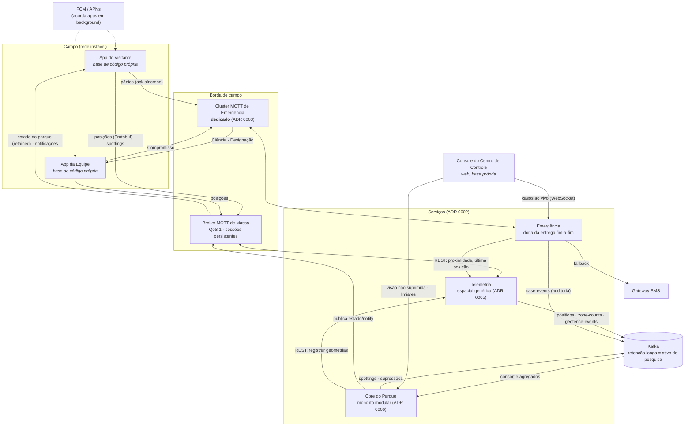
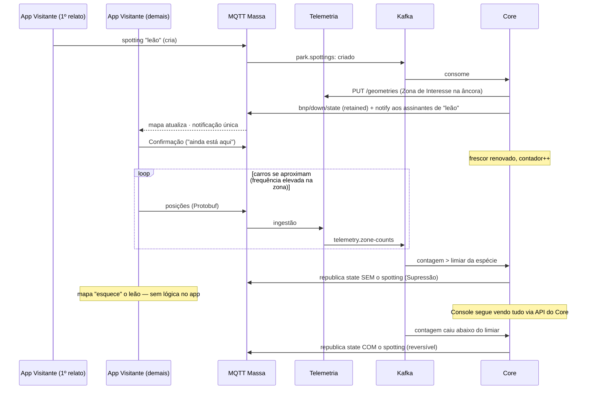
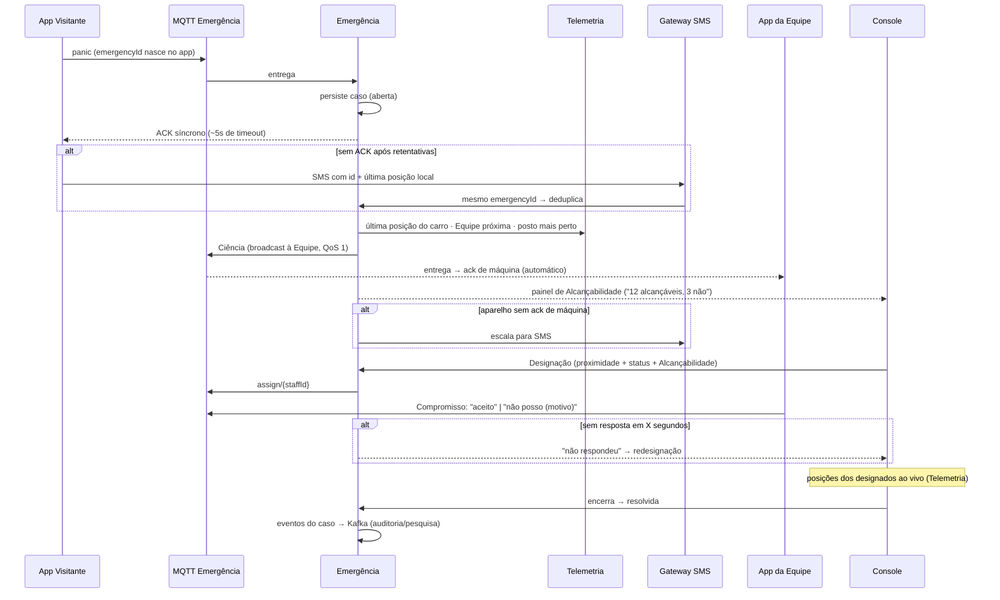

# Arquitetura — BNP Wildlife App

Sistema do Bainomugisha Nature Park para rastrear vida selvagem, informar visitantes e garantir segurança em milhares de km² com cobertura celular instável. Projetado em sessão Design-First Collaboration (níveis Capabilities → Components → Interactions → Contracts); cada decisão estrutural tem um ADR em [`docs/adr/`](./adr/) e o vocabulário canônico vive no [`CONTEXT.md`](../CONTEXT.md).

## Princípios norteadores

Quatro princípios emergiram das decisões e governam qualquer evolução futura:

1. **Fronteiras por carga e criticidade, não por estética de domínio.** Um componente só existe separado se um número (volume de escrita, custo de indisponibilidade) justificar (ADR 0002, 0008).
2. **O cliente é a primeira linha, não a única.** Toda inteligência que precisa funcionar offline mora no dispositivo (avisos, frequência adaptativa); o servidor mantém a avaliação autoritativa (alertas operacionais, auditoria).
3. **Cada camada confirma só o que é capaz de garantir.** QoS confirma o aparelho; só o humano confirma o Compromisso. Estado de entrega é sempre visível, nunca presumido (ADR 0003).
4. **Volátil separado de estável.** Política do parque (limiar, regras de aglomeração) mora nos serviços de domínio, baratos de mudar; física (índice espacial, schema de posição) mora nos serviços de carga, estáveis por anos (ADR 0005, 0008).

## Nível 1 — Capacidades

| # | Capacidade | Observações |
|---|---|---|
| 1 | Onboarding | Conta + telefone + vínculo com placa; consentimento de rastreamento |
| 2 | Informação contextual | Geografia/ecossistema da área atual, por GPS |
| 3 | Spottings (modelo Waze) | Entidade compartilhada criada pelo 1º relato, validada por Confirmações humanas; mapa + assinaturas por espécie; promessa de *quase-tempo-real com entrega eventual* — todo dado carrega o horário do avistamento |
| 4 | Localização contínua adaptativa | Piso mínimo em todo o parque + frequência elevada em Zonas de Interesse; store-and-forward sob falha de rede; Última Posição Conhecida sempre disponível |
| 5 | Saída de Rota | Aviso local imediato ao visitante (offline inclusive) + alerta autoritativo ao Centro de Controle. Extensão proativa do grupo; premissa: rotas mapeadas digitalmente |
| 6 | Controle de aglomeração | Supressão reversível por limiar configurável (espécie/zona); o Centro de Controle nunca tem visão suprimida |
| 7 | Emergência | Pânico com ack síncrono e fallback SMS; Ciência ampla + Designação por proximidade/Alcançabilidade; Compromisso humano; ciclo aberta → designada → resolvida |

## Nível 2 — Componentes



### Responsabilidades

| Componente | Responsabilidade | Não-responsabilidade deliberada |
|---|---|---|
| **App do Visitante** | Onboarding, mapa, spotting/Confirmação, assinaturas, pânico, relato adaptativo com buffer offline, aviso local de saída de Rota | Não decide Supressão nem política — só executa a política publicada |
| **App da Equipe** | Recepção de Ciência/Designação, Compromisso, relato de posição, status | Não vê dados de contas de visitantes |
| **Console do Centro de Controle** | Visão total e não suprimida, gestão de emergências, Designação, limiares, alertas de rota | — |
| **Broker MQTT de Massa** | Conexão dos apps; QoS 1 + sessões persistentes absorvem a rede instável | Não transporta emergência |
| **Cluster MQTT de Emergência** | Exclusivo do caminho crítico, nas duas direções | Não compartilha destino com a telemetria |
| **Telemetria** | Funil de ingestão; índice espacial de Últimas Posições Conhecidas; capacidades espaciais *genéricas* (contagem por zona, proximidade, dentro/fora de geometria); distribui política adaptativa | **Não conhece** Supressão, limiar, espécie (ADR 0005) |
| **Core do Parque** | Módulos: Contas, Spottings & Aglomeração, Assinaturas & Notificações, Conteúdo, Rotas — schema por módulo, sem leitura cruzada (ADR 0006) | Não consome o stream bruto de posições |
| **Emergência** | Dado mestre do caso; Ciência/Designação; rastreamento de entrega (ack de máquina + Compromisso); escalação SMS | Não depende do broker de massa nem do Core para operar |
| **Kafka** | Rio de eventos entre serviços; retenção longa do `telemetry.positions` para pesquisa (ADR 0004); camada de durabilidade do estado quente (ADR 0009) | — |
| **Gateway SMS / FCM·APNs** | Fallback de pânico e entrega; despertar de apps em background | — |

## Nível 3 — Fluxos

### A vida de um Spotting (com Supressão)



### O pânico, ponta a ponta



### Política adaptativa e saída de Rota

O servidor publica a política **como dado** no tópico de estado (geometrias de Zonas, corredores de Rotas, frequências). O app avalia localmente: ajusta a própria frequência ao entrar em zona e avisa o visitante **na hora, mesmo offline**, se saiu do corredor. A Telemetria reavalia tudo por cima das posições recebidas (geofence genérico) e emite o evento autoritativo que vira alerta no Console — *o cliente é a primeira linha, não a única*.

## Nível 4 — Contratos

### Borda (MQTT)

```
bnp/up/pos/{deviceId}        posição (Protobuf — único fluxo binário, ADR 0008)
bnp/up/spotting/{deviceId}   criar / Confirmar / negar (JSON)
bnp/down/state               estado do parque (JSON, retained — 1 mensagem reconstrói o mapa)
bnp/down/notify/{accountId}  notificações de assinatura (JSON)

emg/up/panic/{deviceId}      pânico (JSON)
emg/up/commit/{staffId}      Compromisso (JSON)
emg/down/awareness           Ciência (JSON, QoS 1)
emg/down/assign/{staffId}    Designação (JSON, QoS 1)
```

Regras de contrato da borda:
1. **ACL por identidade**: cada dispositivo só publica nos tópicos com o seu id e só assina os seus; visitante não assina `emg/down/#`.
2. **Timestamps são da medição/ação, nunca do envio** — é o que torna o store-and-forward honesto.
3. **`emergencyId` nasce no app** (UUID): retry e SMS referem o mesmo caso; o servidor deduplica de graça.

### Miolo (Kafka + REST)

```
telemetry.positions        Protobuf · partição por deviceId · retenção longa (pesquisa)
telemetry.zone-counts      JSON · contagem por Zona de Interesse
telemetry.geofence-events  JSON · entrou/saiu de geometria (genérico)
park.spottings             JSON · criado/confirmado/negado/suprimido/expirado
emergency.case-events      JSON · auditoria do ciclo de vida

REST: Emergência→Telemetria (proximidade, última posição) · Core→Telemetria (geometrias)
      Apps→Core (onboarding, auth, conteúdo, fotos) · Console→Emergência (WebSocket) · Console→Core
```

Regras de contrato do miolo:
1. **Comando síncrono, fato por evento** — quem precisa de resposta chama API; quem anuncia o que aconteceu publica no Kafka.
2. **Supressão é ausência no tópico público** — o Core republica o `state` sem o item; a visão completa do Console vem por API. O mecanismo é permissão de leitura, impossível de vazar por bug de filtro no cliente.
3. **Retenção longa com pseudonimização** — histórico frio troca `deviceId` por identificador de viagem; o dado quente (dias) mantém identidade para operação.

### Armazenamento (ADR 0009)

| Serviço | Store | Justificativa |
|---|---|---|
| Core | PostgreSQL (schema por módulo) + PostGIS | Dado mestre; consulta "em que ecossistema estou?" |
| Emergência | PostgreSQL, instância separada e pequena | Isolamento de destino até o banco |
| Telemetria | Redis (GEOSEARCH) + geometrias em memória | Dado efêmero em store efêmero; reinício reconstrói do Kafka |

## Decisões em aberto (deliberadamente)

- **Hospedagem**: nuvem × datacenter na sede do parque (depende do uplink da sede — não havia informação para decidir com honestidade).
- **Provedor de identidade/auth** dos três clientes.
- **Tiles de mapa offline** no app do visitante (fornecedor e estratégia de pré-download).
- Valores concretos de limiares, frequências e timeouts — são configuração do parque, não arquitetura.

## Índice de ADRs

| ADR | Decisão |
|---|---|
| [0001](./adr/0001-rastreamento-continuo-adaptativo.md) | Rastreamento contínuo e adaptativo de localização |
| [0002](./adr/0002-decomposicao-por-carga-e-criticidade.md) | Decomposição em 3 serviços por carga e criticidade |
| [0003](./adr/0003-entrega-de-emergencia-fim-a-fim.md) | Entrega de emergência fim-a-fim, ack de máquina + Compromisso humano |
| [0004](./adr/0004-mqtt-na-borda-kafka-no-miolo.md) | MQTT na borda, Kafka no miolo |
| [0005](./adr/0005-telemetria-generica-dominio-no-core.md) | Telemetria genérica; lógica de aglomeração no Core |
| [0006](./adr/0006-core-monolito-modular-schema-por-modulo.md) | Core: monólito modular, schema por módulo |
| [0007](./adr/0007-spotting-compartilhado-modelo-waze.md) | Spotting compartilhado (modelo Waze), sem agregação automática |
| [0008](./adr/0008-protobuf-na-telemetria-json-no-resto.md) | Protobuf no funil de telemetria, JSON+Schema no resto |
| [0009](./adr/0009-redis-quente-postgres-mestre-kafka-durabilidade.md) | Redis quente, Postgres mestre, Kafka como durabilidade |
