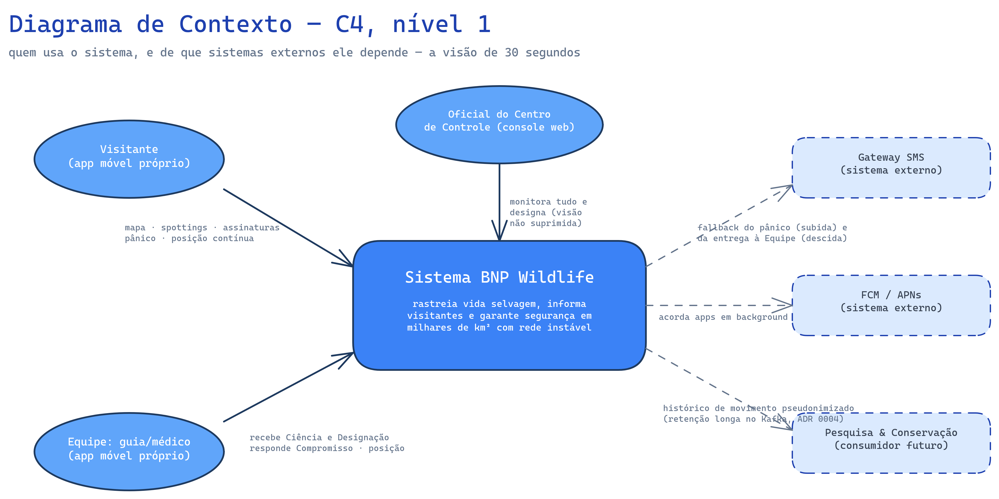
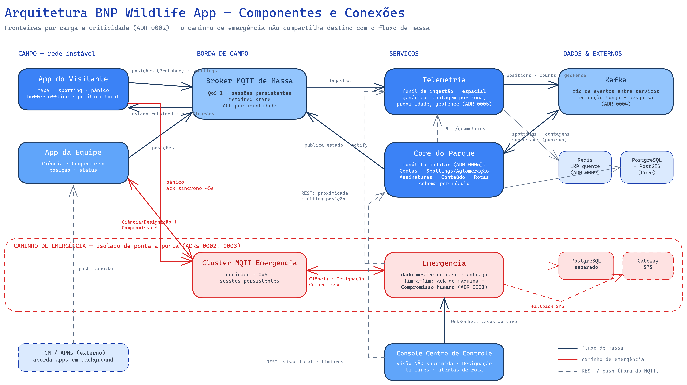
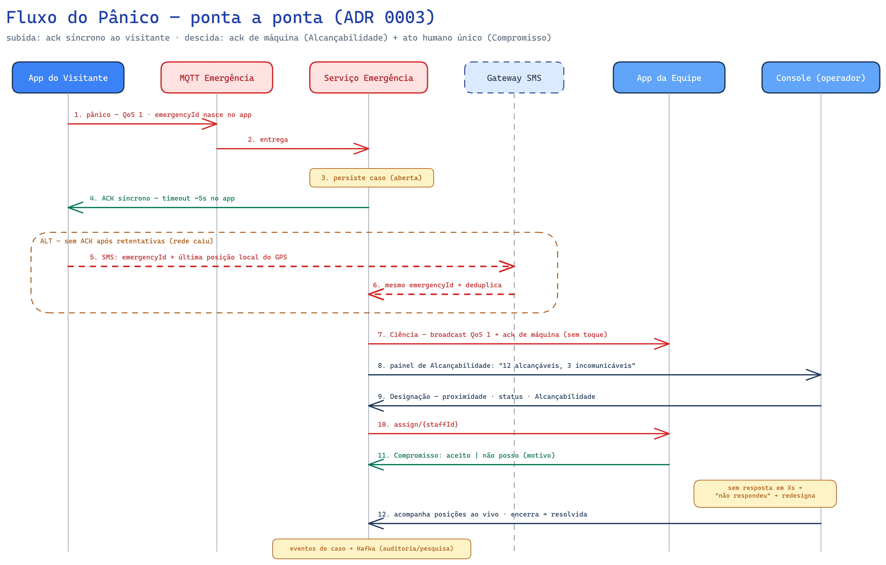
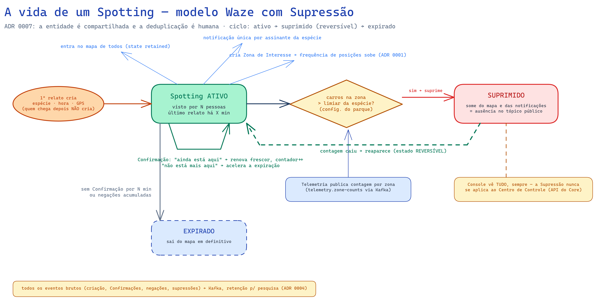
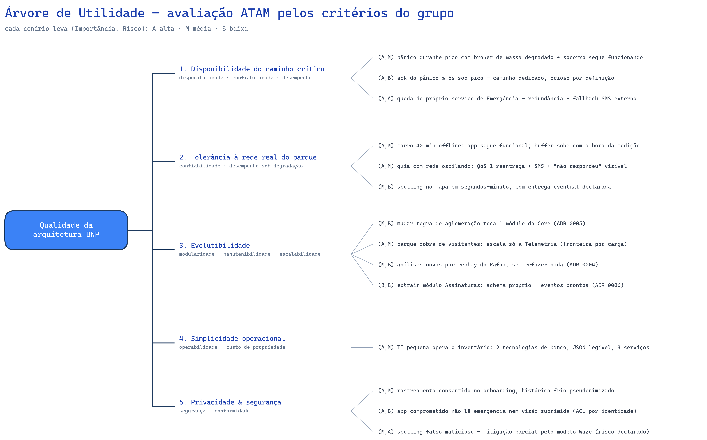

# Arquitetura de Software — BNP Wildlife App

**Disciplina:** Arquitetura de Software · **Atividade:** Projeto de arquitetura com IA Generativa (2ª edição, com Design-First Collaboration)
**LLM utilizado:** Claude (Fable 5), via Claude Code, em sessão interativa com a equipe
**Método:** [Design-First Collaboration (Rahul Garg, martinfowler.com)](https://martinfowler.com/articles/reduce-friction-ai/design-first-collaboration.html) — níveis progressivos Capabilities → Components → Interactions → Contracts, com aprovação humana em cada checkpoint e **nenhum artefato de nível seguinte antes de fechar o nível atual**

**O processo, em resumo:** o protocolo do artigo foi executado como uma **entrevista estruturada** (skill `grill-with-docs`): a cada decisão, o agente apresentou opções genuínas com trade-offs e uma recomendação, e só avançou com aprovação da equipe — 17+ perguntas ao longo dos quatro níveis. Durante a conversa, e não depois dela, nasceram os artefatos: um **glossário de domínio** no espírito da linguagem ubíqua do DDD, atualizado termo a termo; **9 ADRs** registrados no momento de cada decisão, sob critério triplo (difícil de reverter + surpreendente + trade-off real); e **5 diagramas Excalidraw** construídos com um loop em que o próprio agente renderiza, inspeciona a imagem e corrige seus defeitos visuais. A equipe reverteu decisões do LLM em três momentos, contribuiu com duas capacidades que o LLM não propôs, e redirecionou o formato final dos entregáveis (consolidação + troca de Mermaid por Excalidraw). **O relato completo, com os momentos de steering e as ferramentas, está na seção 9.**

Este documento é autocontido: contém a arquitetura completa, os diagramas, a avaliação de qualidade pelos critérios do grupo, o relato do processo e, em apêndice, **todos os ADRs na íntegra** e o glossário do domínio.

---

## 1. O sistema

O Bainomugisha Nature Park (BNP) encomendou um sistema para rastrear vida selvagem, informar visitantes e garantir segurança em **milhares de km² com cobertura celular instável**. O escopo definido pelo grupo cobre o sistema completo: o app do visitante, o app da equipe do parque (guias e médicos) e o console do centro de controle — o fluxo de emergência do enunciado só funciona com as três pontas.



O diagrama de contexto (C4, nível 1) enquadra o escopo: três atores humanos, três sistemas externos — e a saída de dados para Pesquisa & Conservação, que justificou uma das decisões de tecnologia mais importantes (ADR 0004).

### Princípios norteadores

Quatro princípios emergiram das decisões e governam qualquer evolução futura:

1. **Fronteiras por carga e criticidade, não por estética de domínio.** Um componente só existe separado se um número (volume de escrita, custo de indisponibilidade) justificar (ADRs 0002, 0008).
2. **O cliente é a primeira linha, não a única.** Toda inteligência que precisa funcionar offline mora no dispositivo; o servidor mantém a avaliação autoritativa.
3. **Cada camada confirma só o que é capaz de garantir.** O QoS confirma o aparelho; só o humano confirma o Compromisso. Estado de entrega é sempre visível, nunca presumido (ADR 0003).
4. **Volátil separado de estável.** Política do parque mora nos serviços de domínio, baratos de mudar; física (índice espacial, schema de posição) mora nos serviços de carga, estáveis por anos (ADRs 0005, 0008).

## 2. Capacidades (Nível 1)

| # | Capacidade | Observações |
|---|---|---|
| 1 | Onboarding | Conta + telefone + vínculo com placa; consentimento de rastreamento |
| 2 | Informação contextual | Geografia/ecossistema da área atual, por GPS |
| 3 | Spottings (modelo Waze) | Entidade compartilhada criada pelo 1º relato, validada por Confirmações humanas; mapa + assinaturas por espécie; promessa de *quase-tempo-real com entrega eventual* — todo dado carrega o horário do avistamento |
| 4 | Localização contínua adaptativa | Piso mínimo em todo o parque + frequência elevada em Zonas de Interesse; *store-and-forward* sob falha de rede; Última Posição Conhecida sempre disponível |
| 5 | Saída de Rota | Aviso local imediato ao visitante (offline inclusive) + alerta autoritativo ao Centro de Controle. *Extensão proativa do grupo*; premissa: rotas mapeadas digitalmente |
| 6 | Controle de aglomeração | Supressão reversível por limiar configurável (espécie/zona); o Centro de Controle nunca tem visão suprimida |
| 7 | Emergência | Pânico com ack síncrono e fallback SMS; Ciência ampla + Designação por proximidade/Alcançabilidade; Compromisso humano; ciclo aberta → designada → resolvida |

As ambiguidades do enunciado foram resolvidas explicitamente: o "tempo razoável" virou promessa nomeada (quase-tempo-real com entrega eventual); a tensão entre "encaminha a todos os guias" e "o oficial seleciona" virou dois estágios distintos (Ciência ≠ Designação); e o rastreamento contínuo — que não está escrito no enunciado, mas sem o qual o controle de aglomeração e o despacho por proximidade não existem — foi promovido a capacidade de primeira classe.

## 3. Componentes (Nível 2)



O backend é decomposto em **3 serviços** com fronteiras justificadas por características mensuráveis (ADR 0002): a **Telemetria** isola o único fluxo de alto volume (escrita contínua de posições); a **Emergência** isola o caminho de criticidade máxima, que precisa sobreviver à queda de todo o resto; o **Core do Parque** concentra o domínio de volume moderado, organizado como monólito modular com schema por módulo (ADR 0006). O argumento decisivo: *o botão de pânico não pode compartilhar destino com o mapa de spottings.*

| Componente | Responsabilidade | Não-responsabilidade deliberada |
|---|---|---|
| **App do Visitante** | Onboarding, mapa, spotting/Confirmação, assinaturas, pânico, relato adaptativo com buffer offline, aviso local de saída de Rota | Não decide Supressão nem política — executa a política publicada |
| **App da Equipe** | Recepção de Ciência/Designação, Compromisso, posição, status | Não vê dados de contas de visitantes |
| **Console do Centro de Controle** | Visão total e não suprimida, gestão de emergências, Designação, limiares, alertas de rota | — |
| **Broker MQTT de Massa** | Conexão dos apps; QoS 1 + sessões persistentes absorvem a rede instável | Não transporta emergência |
| **Cluster MQTT de Emergência** | Exclusivo do caminho crítico, nas duas direções | Não compartilha destino com a telemetria |
| **Telemetria** | Funil de ingestão; índice espacial de Últimas Posições Conhecidas; capacidades espaciais *genéricas* (contagem por zona, proximidade, geofence); distribui a política adaptativa | **Não conhece** Supressão, limiar, espécie (ADR 0005) |
| **Core do Parque** | Módulos: Contas, Spottings & Aglomeração, Assinaturas & Notificações, Conteúdo, Rotas | Não consome o stream bruto de posições |
| **Emergência** | Dado mestre do caso; Ciência/Designação; rastreamento de entrega (ack de máquina + Compromisso); escalação SMS | Não depende do broker de massa nem do Core para operar |
| **Kafka** | Rio de eventos entre serviços; retenção longa como ativo de pesquisa (ADR 0004); durabilidade do estado quente (ADR 0009) | — |
| **Gateway SMS / FCM·APNs** | Fallback de pânico e de entrega; despertar de apps em background | — |

Os três clientes são **bases de código separadas**: públicos, ciclos de release e regimes de permissão diferentes — separar elimina por construção o risco de vazar tela ou endpoint pelo bundle errado.

## 4. Fluxos (Nível 3)

### 4.1 O pânico, ponta a ponta



A emergência tem duas pernas com necessidades opostas. Na **subida**, o que importa é o ack imediato: o app só considera o pânico enviado ao receber confirmação síncrona (~5s); sem ela, escala para SMS — com o mesmo `emergencyId`, gerado no app, para o servidor deduplicar. Na **descida**, o que importa é chegar: QoS 1 e sessões persistentes reentregam no protocolo; o ack de máquina (automático, sem toque) alimenta o painel de **Alcançabilidade** do operador; e o único ato humano do protocolo é o **Compromisso** do designado ("aceito" / "não posso"). A falta de resposta vira estado visível ("não respondeu") e dispara redesignação — nunca risco silencioso.

### 4.2 A vida de um Spotting



O modelo é o do Waze (ADR 0007): o primeiro relato **cria** a entidade compartilhada; quem chega depois **Confirma** ou nega — a deduplicação é humana, sem heurística no servidor. A Supressão é implementada como **ausência no tópico público**: o Core republica o estado retained sem o item e o mapa dos visitantes o esquece, sem lógica no app; a visão completa do Console vem por API autenticada — o mecanismo é permissão de leitura, impossível de vazar por bug de filtro no cliente.

### 4.3 Política adaptativa e saída de Rota

O servidor publica a política **como dado** (geometrias de Zonas de Interesse, corredores de Rotas, frequências) no tópico de estado. O app avalia localmente: ajusta a frequência ao entrar em zona e avisa o visitante **na hora, mesmo offline**, se saiu do corredor. A Telemetria reavalia tudo por cima das posições recebidas e emite o evento autoritativo que vira alerta no Console — *o cliente é a primeira linha, não a única*.

## 5. Contratos (Nível 4)

### Borda (MQTT)

```
bnp/up/pos/{deviceId}        posição (Protobuf — único fluxo binário, ADR 0008)
bnp/up/spotting/{deviceId}   criar / Confirmar / negar (JSON)
bnp/down/state               estado do parque (JSON, retained — 1 mensagem reconstrói o mapa)
bnp/down/notify/{accountId}  notificações de assinatura (JSON)

emg/up/panic/{deviceId}      pânico (JSON)
emg/up/commit/{staffId}      Compromisso (JSON)
emg/down/awareness           Ciência (JSON, QoS 1)
emg/down/assign/{staffId}    Designação individual (JSON, QoS 1)
```

Regras de contrato da borda:

1. **ACL por identidade**: cada dispositivo só publica nos tópicos com o seu id e só assina os seus; visitante não assina `emg/down/#`.
2. **Timestamps são da medição/ação, nunca do envio** — é o que torna o store-and-forward honesto.
3. **`emergencyId` nasce no app** (UUID): retry e SMS referem o mesmo caso; o servidor deduplica de graça.

### Miolo (Kafka + REST)

```
telemetry.positions        Protobuf · partição por deviceId · retenção longa (pesquisa)
telemetry.zone-counts      JSON · contagem de carros por Zona de Interesse
telemetry.geofence-events  JSON · entrou/saiu de geometria registrada (genérico)
park.spottings             JSON · criado/confirmado/negado/suprimido/expirado
emergency.case-events      JSON · auditoria do ciclo de vida dos casos

REST: Emergência→Telemetria (proximidade, última posição) · Core→Telemetria (geometrias)
      Apps→Core (onboarding, auth, conteúdo, fotos) · Console→Emergência (WebSocket) · Console→Core
```

Regras de contrato do miolo:

1. **Comando síncrono, fato por evento** — quem precisa de resposta chama API; quem anuncia o que aconteceu publica no Kafka.
2. **Supressão é ausência no tópico público** — a visão completa do Console vem por API; o mecanismo é permissão de leitura.
3. **Retenção longa com pseudonimização** — o histórico frio troca `deviceId` por identificador de viagem; o dado quente (dias) mantém identidade para operação.

### Armazenamento (ADR 0009)

| Serviço | Store | Justificativa |
|---|---|---|
| Core | PostgreSQL (schema por módulo) + PostGIS | Dado mestre; consulta "em que ecossistema estou?" |
| Emergência | PostgreSQL, instância separada e pequena | Isolamento de destino até o banco |
| Telemetria | Redis (GEOSEARCH) + geometrias em memória | Dado efêmero em store efêmero; reinício reconstrói do Kafka |

## 6. Avaliação de qualidade (critérios do grupo)

Critérios definidos pelo grupo, avaliados por **cenários concretos** (mini-ATAM). Cada critério declara os atributos clássicos que cobre — a tríade modularidade/escalabilidade/desempenho aparece mapeada, não diluída.

| Critério do grupo | Atributos cobertos |
|---|---|
| 1. Disponibilidade do caminho crítico | Disponibilidade, confiabilidade, **desempenho** (latência do ack) |
| 2. Tolerância à rede real do parque | Confiabilidade, **desempenho sob degradação**, resiliência |
| 3. Evolutibilidade | **Modularidade**, manutenibilidade, **escalabilidade** |
| 4. Simplicidade operacional | Operabilidade, custo de propriedade |
| 5. Privacidade & segurança | Segurança, conformidade |

A árvore de utilidade abaixo — o artefato canônico do ATAM (Bass, Clements & Kazman, SEI) — organiza os 13 cenários por critério, cada um priorizado por **(Importância, Risco)**. Os cenários (A,A) e (M,A) são os pontos de atenção honestos da arquitetura:



**1 — Disponibilidade do caminho crítico.** *Sábado de pico, o broker de massa degrada sob a tempestade de spottings, um visitante aperta o pânico:* o pânico não toca o broker de massa — cluster dedicado + serviço próprio + banco próprio (ADRs 0002/0003/0009). *Ack ≤ 5s sob pico:* o caminho do ack atravessa só infraestrutura ociosa por definição (emergências são raras) — atende por construção. *O próprio serviço de Emergência cai:* risco residual honesto; mitigação por redundância + o fallback SMS do app, que não depende de componente nosso.

**2 — Tolerância à rede real.** *Carro 40 min offline:* app segue funcional (estado retained, política local, buffer); na reconexão a sessão persistente entrega o que desceu e o buffer sobe com horário da medição — perde-se frescor, nunca dados, e a defasagem é visível. *Guia com rede oscilando:* QoS 1 reentrega; sem ack de máquina → SMS; sem Compromisso → "não respondeu" no console. A oscilação vira estado visível, não risco silencioso. *Frescor do spotting (desempenho):* todos os saltos são push; o gargalo honesto é a rede do visitante — exatamente o que a promessa "com entrega eventual" reconhece.

**3 — Evolutibilidade.** *Mudar regra de aglomeração:* 1 módulo (Core); a Telemetria não conhece Supressão (ADR 0005). *Parque dobra (escalabilidade):* o fluxo que dobra é a telemetria — exatamente o serviço isolado por carga, horizontalmente escalável. *Análises novas:* replay do Kafka materializa qualquer vista — inclusive a base PostGIS descartada no ADR 0009, se fizer falta. *Assinaturas viram serviço:* schema próprio + eventos no Kafka = extração barata (ADR 0006).

**4 — Simplicidade operacional.** Inventário: 3 serviços, 2 clusters MQTT, Kafka, 2 Postgres, 1 Redis. É mais que um monólito — custo pago conscientemente por isolamento de falha e carga. Mitigações estruturais: 2 tecnologias de banco apenas, Protobuf confinado a 1 mensagem estável, e o número de serviços travado pelo critério "fronteira nova só com número que a justifique". Foi este critério que vetou os microserviços por capacidade.

**5 — Privacidade & segurança.** Consentimento no onboarding; dado quente identificado vive dias e serve à segurança do próprio visitante; histórico frio pseudonimizado. ACL por identidade no broker; visão não suprimida só existe em API autenticada; 3 bases de código eliminam o vazamento por bundle errado. *Risco residual declarado:* spotting falso malicioso — mitigação parcial pelo modelo Waze (negações aceleram expiração); moderação ativa fora do escopo.

### Trade-offs aceitos

| Decisão | Ganhamos | Pagamos | Reversão |
|---|---|---|---|
| 3 serviços, não monólito (ADR 0002) | Isolamento de falha/carga do caminho crítico | Falhas parciais, contratos versionados | Cara |
| Modelo Waze, sem agregação automática (ADR 0007) | Zero heurística errando Supressão | Depende da cooperação dos visitantes | Barata |
| Kafka, não RabbitMQ (ADR 0004) | Replay + histórico como ativo de pesquisa | Peso operacional maior | Cara |
| Híbrido Protobuf/JSON (ADR 0008) | Bytes onde dói, legibilidade onde itera | Dois ferramentais (com guardas) | Média |
| Redis, não PostGIS na Telemetria (ADR 0009) | Store casado com a natureza efêmera do dado | Geometria em código próprio; +1 tecnologia | Barata (replay) |
| Broadcast, não tópicos regionais | Simplicidade + mapa completo offline | Bytes desnecessários por app | Barata (migração por células) |

**Síntese:** a arquitetura concentra seu orçamento de complexidade nos dois pontos onde o enunciado não perdoa — o caminho de emergência e a rede instável — e compra simplicidade em todo o resto, com riscos residuais declarados em vez de escondidos.

## 7. Ancoragem na literatura

O documento cobre as vistas do modelo **4+1 de Kruchten**: a *vista lógica* é a seção de componentes e responsabilidades; a *vista de processo* são os fluxos do Nível 3 (sequência do pânico, vida do Spotting); os *cenários* — a quinta vista, que amarra as demais — são a avaliação ATAM da seção 6. A *vista de desenvolvimento* aparece nas decisões de organização de código (3 bases de cliente, monólito modular do Core — ADR 0006). A *vista física* (implantação) está **deliberadamente ausente**: a hospedagem é decisão em aberto por falta de informação sobre o uplink da sede do parque, e desenhar nós de infraestrutura agora seria fingir certeza — a ausência é uma decisão, não um esquecimento.

Em termos de **estilos arquiteturais** (Shaw & Garlan), o sistema combina três, cada um onde seu trade-off compensa: *publish-subscribe orientado a eventos* no miolo (Kafka — desacoplamento temporal e replay), *cliente-servidor com mensageria* na borda (MQTT — a rede instável é absorvida pelo protocolo, não pelo código), e *camadas com módulos* dentro do Core. As notações usadas são **C4** (contexto e contêineres), **diagramas de sequência UML** (fluxos) e a **árvore de utilidade do ATAM** (avaliação).

## 8. Decisões deliberadamente em aberto

- **Hospedagem** (nuvem × datacenter na sede do parque): depende do uplink da sede — não havia informação para decidir sem inventar requisito.
- **Provedor de identidade/auth** dos três clientes.
- **Tiles de mapa offline** no app do visitante.
- Valores concretos de limiares, frequências e timeouts — são configuração do parque, não arquitetura.

## 9. Relato do processo (evidências)

A sessão seguiu os níveis do Design-First com **17 perguntas**, cada uma com opções genuínas e recomendação, aprovadas uma a uma pela equipe em call. Momentos-chave em que a colaboração mudou o design:

- **Nível 1:** a equipe trouxe o relato adaptativo por zonas (inspiração no app Citta Mobbi) e a detecção de saída de rota — extensões além do enunciado; e exigiu o store-and-forward para rede instável.
- **Nível 2:** a preocupação da equipe ("e o guia com rede oscilando?") derrubou a proposta inicial de descida síncrona e levou ao princípio "o estado de entrega pertence ao serviço de Emergência" + cluster dedicado (ADR 0003). A preocupação com o Core "fazendo tudo" gerou o monólito modular com schema por módulo (ADR 0006).
- **Nível 3:** o LLM propôs agregação automática de relatos ("Presença"); **a equipe contrapropôs o modelo Waze** — mais simples e mais preciso (ADR 0007). A equipe também questionou e matou o "recebi" manual, substituído por ack de máquina + Compromisso (emenda ao ADR 0003 em sessão).
- **Nível 4:** a equipe rejeitou Protobuf uniforme; o LLM reconheceu que a fronteira do híbrido coincide com a fronteira de carga já decidida, e a decisão saiu conjunta, com guardas (ADR 0008).

**Resumo honesto:** três decisões do LLM foram revertidas ou refinadas por intervenção humana; duas contribuições da equipe entraram no design sem terem sido propostas pelo LLM; nenhuma linha de contrato foi escrita antes do nível correspondente fechar. O checkpoint por nível funcionou como o artigo descreve: desacordos custaram minutos, não retrabalho. A transcrição completa da sessão (prompts e respostas) acompanha este documento como anexo de evidências.

### As ferramentas do processo: skills do agente

O Design-First do artigo é um *protocolo de conversa*; o que tornou o protocolo executável na prática foram **skills** — instruções reutilizáveis instaladas no agente (Claude Code) que codificam um modo de trabalhar. Três tiveram papel estrutural:

**`grill-with-docs` — a entrevista que produz documentação como efeito colateral.** A skill instrui o agente a entrevistar a equipe *incessantemente*, uma pergunta por vez, sempre com opções e uma recomendação — e foi ela que impôs a disciplina de nível do Design-First (o agente não avança sem aprovação). Três mecanismos dela explicam a forma dos nossos artefatos:

- **Glossário vivo (`CONTEXT.md`), no espírito da linguagem ubíqua do DDD (Evans):** a skill manda capturar cada termo *no momento em que ele é resolvido na conversa*, não em lote no final — e o arquivo é criado sob demanda, a partir do primeiro termo. Foi assim que "Spotting", "Supressão", "Ciência", "Alcançabilidade" e "Compromisso" ganharam definição canônica e lista de sinônimos a evitar; quando um termo nosso conflitava com o glossário, o agente desafiava na hora. O Apêndice B é esse arquivo.
- **ADRs sob demanda, com critério triplo:** a skill proíbe registrar ADR por ritual — só quando a decisão é (1) difícil de reverter, (2) surpreendente sem contexto e (3) fruto de trade-off real. Por isso são 9 ADRs e não 17: as decisões que falharam no teste (ex.: broadcast vs tópicos regionais, fácil de reverter) ficaram documentadas como texto comum, não como ADR. Cada ADR nasceu *na hora da decisão*, com as alternativas rejeitadas ainda frescas.
- **Anti-espantalho:** após feedback da equipe ("as opções não recomendadas estão superficiais"), a regra "toda opção deve ser uma candidata genuína com defesa honesta" foi gravada no repositório (`AGENTS.md`) — ou seja, o processo se auto-corrigiu *e persistiu a correção* para qualquer sessão futura.

**`excalidraw-diagram` — diagramas que argumentam.** A skill codifica uma filosofia ("diagramas devem ARGUMENTAR, não exibir": a estrutura visual deve espelhar o conceito — ex.: a faixa vermelha contínua do caminho de emergência no diagrama de componentes *é* o argumento do ADR 0002) e um processo: gerar o JSON por seções, **renderizar para PNG, inspecionar a imagem e corrigir em loop** até passar num checklist de defeitos visuais. Os 5 diagramas deste documento passaram por esse ciclo (colisões de rótulos e setas desconectadas foram detectadas e corrigidas na inspeção). Nota honesta: o renderizador da skill estava quebrado (dependência com 404 no CDN) e foi consertado durante a sessão — o conserto também ficou commitado.

**O agente (Claude Code) como cola:** a mesma sessão que conduziu a entrevista editou os arquivos do repositório em tempo real (glossário, ADRs, este documento), versionou tudo em git e renderizou os diagramas — o que significa que **a documentação nunca esteve dessincronizada da conversa**. A diferença para a atividade anterior não foi só o protocolo (níveis com checkpoint), foi a infraestrutura: na primeira, o LLM devolvia texto para copiar; nesta, cada decisão aprovada virava artefato versionado no mesmo minuto.

### Da primeira versão aos entregáveis: o steering também faz parte do processo

Os documentos que você está lendo **não são a primeira versão** — e o caminho entre as duas é, em si, evidência de como a colaboração funcionou.

**Primeira versão (fechamento do Nível 5):** o agente produziu a documentação no formato natural de um repositório de software — seis arquivos pequenos e interligados (`arquitetura.md`, `avaliacao-qualidade.md`, `processo-design-first.md`, `notas-comparativo.md`, mais `CONTEXT.md` e os 9 ADRs em arquivos separados), com diagramas em **Mermaid** embutidos no markdown. Para documentação *viva* de um repositório, esse formato é o correto: arquivos pequenos versionam bem, ADRs separados são referenciáveis, e Mermaid renderiza nativamente no GitHub.

**O steering:** a equipe apontou o desencaixe com o enunciado — o professor pede *PDFs ou Docs* de evidências, e entregar 15 arquivos interligados obrigaria a "entregar a codebase inteira". O redirecionamento: documentos **autocontidos e em menor quantidade** (este documento absorveu os quatro intermediários, com ADRs na íntegra e glossário em apêndice), mantendo `CONTEXT.md` e `docs/adr/` como fonte viva no repositório. O mesmo conteúdo, dois formatos, cada um certo para seu leitor — e a primeira versão continua visível no histórico git, como evidência.

**A troca Mermaid → Excalidraw:** a equipe também pediu a troca da ferramenta de diagramas, e a justificativa técnica merece registro. Mermaid gera o layout **automaticamente a partir de texto**: é barato e roda no GitHub, mas ninguém controla onde as caixas caem — o resultado é genérico, frequentemente feio, e o ponto decisivo: **o modelo não vê o que gerou**. Um diagrama Mermaid com rótulos colidindo ou setas cruzadas sai do jeito que sai. Com Excalidraw + o loop da skill, o agente **renderiza o diagrama em imagem, olha, e corrige** — neste trabalho, isso pegou e consertou rótulos sobrepostos, uma seta desconectada do estado de origem e colisões de texto, em 2–3 iterações por diagrama. Além do controle fino de layout que permite ao diagrama *argumentar* (a faixa vermelha do caminho de emergência, a árvore de utilidade com leiaute canônico), o formato `.excalidraw` fica versionado e **editável pela equipe** no excalidraw.com — o diagrama vira artefato colaborativo, não saída descartável. O custo honesto: cada diagrama exigiu ordens de grandeza mais trabalho que um bloco Mermaid; pagou-se porque o destino é um PDF avaliado, onde a qualidade visual carrega parte da nota.

A lição que o grupo tira disso: com IA, a primeira saída raramente é o entregável — e o valor do processo está em poder **redirecionar com critérios** ("autocontido", "menos arquivos", "diagrama que se auto-corrige") em vez de reescrever na mão.

---

## Apêndice A — ADRs na íntegra

### ADR 0001 — Rastreamento contínuo e adaptativo de localização

O controle de aglomeração precisa contar carros perto de animais e a designação de emergência precisa da proximidade da Equipe — ambos exigem que o sistema conheça posições continuamente, não apenas quando alguém reporta algo. Decidimos que os apps reportam localização de forma contínua e **adaptativa**: um piso mínimo de frequência em todo o parque (garante Última Posição Conhecida útil para emergências) e frequência elevada dentro de Zonas de Interesse, criadas dinamicamente ao redor de spottings recentes e emergências ativas. A política de frequência é ditada pelo servidor, que é quem conhece as zonas. Como a cobertura de rede no parque é instável, o app armazena posições localmente e envia quando há conexão (store-and-forward).

*Opções consideradas:* **localização apenas em eventos** (mais simples e mais privada, mas torna a contagem de carros uma estimativa cega e degrada o despacho por proximidade); **frequência fixa para todos** (gasta bateria e rede onde a precisão não importa e entrega contagem fraca onde importa).

*Consequências:* sair da Rota torna-se detectável e gera alerta ao Centro de Controle (extensão além do enunciado). Premissa explícita: o BNP possui as rotas mapeadas digitalmente. O consentimento de rastreamento passa a fazer parte do onboarding.

### ADR 0002 — Decomposição em poucos serviços, separados por carga e criticidade

O backend é decomposto em três serviços, com fronteiras justificadas por características mensuráveis e não por afinidade de domínio: (1) **Ingestão de Telemetria** — escrita contínua e volumosa de posições, que não pode enfileirar atrás de nada; (2) **Emergência** — volume baixíssimo, criticidade máxima, precisa sobreviver à queda de todo o resto; (3) **Core do Parque** — spottings, assinaturas, conteúdo e contas: volume moderado, criticidade média. O argumento decisivo: o caminho de emergência não pode compartilhar destino com o mapa de spottings — quando o parque inteiro estiver reportando um leão, o botão de pânico tem que continuar funcionando.

*Opções consideradas:* **monólito modular + broker** (operacionalmente mais barato, rejeitado porque dentro de um único processo a isolação de falha do caminho de emergência nunca é total); **microserviços por capacidade de negócio** (~6 serviços; rejeitado porque o custo operacional chega antes do benefício na escala de um parque).

### ADR 0003 — Entrega de emergência: caminho dedicado com confirmação em duas camadas

A emergência tem duas pernas com necessidades opostas: na subida (visitante → sistema) importa o ack imediato — o app só considera o pânico enviado ao receber confirmação síncrona, senão escala para SMS; na descida (sistema → Equipe) importa chegar, custe o tempo que custar — o receptor com rede oscilante é o caso normal. Decidimos: a emergência é persistida no serviço de Emergência no instante em que chega (ela é dado mestre, não mensagem em trânsito); a descida usa um cluster de mensageria **dedicado**; e a confirmação tem **duas camadas, cada uma garantindo só o que é capaz de garantir**:

- **Ack de máquina (automático, sem interação):** o protocolo confirma que a mensagem chegou ao aparelho. Basta para a Ciência — o operador vê a Alcançabilidade de toda a Equipe sem fadiga de ack. Sem ack de máquina, o serviço reenvia e escala para SMS.
- **Resposta humana (um único ato, só para designados):** o designado responde "aceito" ou "não posso" — o Compromisso, a única coisa que máquina nenhuma confirma. Sem resposta em X segundos, o console mostra "não respondeu" e o operador redesigna.

Durabilidade de transporte não é garantia de entrega: nenhum broker faz o celular sem sinal receber, e nenhum QoS confirma que o guia *viu*. Por isso o estado de entrega pertence ao serviço de Emergência, qualquer que seja o transporte. Um "recebi" manual foi considerado e descartado: para os não-designados não há o que aceitar, e para os designados seria um toque redundante antes do "aceito".

*Opções consideradas:* **broker único em HA com filas de prioridade** (rejeitado: o caminho crítico compartilharia destino com a tempestade de telemetria, e o rastreamento de confirmação humana teria que ser construído de qualquer forma); **descida síncrona** (rejeitado: a oscilação de rede dos receptores exige reentrega durável, não falha rápida).

### ADR 0004 — MQTT na borda de campo, Kafka no miolo

Os apps falam com o sistema via **MQTT**: QoS 1 (reentrega até o dispositivo confirmar) e sessões persistentes (o broker retém mensagens de quem caiu da rede e entrega na reconexão) resolvem no protocolo a realidade de rede instável do parque — nas duas direções. O caminho de emergência usa um cluster MQTT dedicado (ADR 0003). Entre os serviços, o fluxo de massa passa por **Kafka**: a retenção e o replay transformam a telemetria em ativo de dados — trilhas de movimentação, padrões de aglomeração, pesquisa e conservação — que o parque declarou querer explorar.

*Opções consideradas:* **RabbitMQ no miolo** (metade do peso operacional; seria a escolha se apenas o "agora" importasse — rejeitado porque o grupo confirmou o histórico como requisito de dados); **HTTP/REST direto dos apps** (rejeitado: empurraria retry, buffer offline e dedup para código nosso em cada app).

### ADR 0005 — Telemetria é serviço espacial genérico; lógica de aglomeração mora no Core

A consulta de proximidade é necessária a três features distintas (contagem de carros, Designação por proximidade, política adaptativa) — o que prova que ela é capacidade genérica de infraestrutura, não regra de negócio. A Telemetria mantém o índice espacial e oferece capacidades genéricas (contagens por zona, proximidade, dentro/fora de geometrias), sem conhecer Supressão, limiar ou espécie. Toda a regra de aglomeração mora no Core. Critério: regra de aglomeração é política do parque e mudará sempre; índice espacial é física e fica estável por anos — a parte volátil mora no serviço barato de mudar.

*Opção considerada:* **decidir a Supressão dentro da Telemetria** (decisão onde o dado nasce, sem hop; rejeitado porque conceitos de domínio vazariam para o funil de escrita de alto volume).

### ADR 0006 — Core do Parque: monólito modular com schema por módulo

O Core concentra capacidades de domínio heterogêneas (Contas, Spottings & Aglomeração, Assinaturas & Notificações, Conteúdo, Rotas). Para que não degenere num emaranhado: cada módulo tem seu **próprio schema no banco**, e **módulo não lê tabela de outro módulo** — comunicação por interface interna ou evento. Se um módulo crescer a ponto de merecer virar serviço, a extração fica barata. Este ADR existe para barrar a "simplificação" futura óbvia: um JOIN atravessando schemas de módulos diferentes — essa fronteira é deliberada.

*Consequência:* consultas que cruzam módulos são compostas na camada de aplicação ou via dados replicados por evento — nunca por leitura direta do schema alheio.

### ADR 0007 — Spotting compartilhado com confirmação humana (modelo Waze), sem agregação automática

Trinta carros vendo o mesmo leão não podem virar trinta pins e trinta notificações — e a Supressão precisa de uma entidade ancorada para contar "carros na proximidade do animal". Decidimos o modelo Waze: o primeiro relato **cria** o Spotting; quem chega depois **Confirma** ("ainda está aqui", renovando frescor) ou nega ("não está mais aqui", acelerando expiração); um animal genuinamente diferente vira um Spotting novo, a critério de quem está olhando para o animal. A deduplicação é humana — não existe clustering automático no servidor. Eventos brutos seguem para o Kafka para pesquisa.

*Opções consideradas:* **cada relato é um pin independente com TTL** (sem heurística, mas gera spam de notificações e explosão de Zonas — e a Supressão fica sem referente); **agregação automática por raio + janela + espécie** (resolve a ancoragem, mas a heurística erra nas bordas — dois leões a 300m viram um — e o erro contamina a Supressão).

*Consequência:* o modelo depende de cooperação dos visitantes; a expiração por tempo sem Confirmação segura a linha de base sozinha.

### ADR 0008 — Protobuf no funil de telemetria, JSON com JSON Schema em todo o resto

A mensagem de posição é o único fluxo de alto volume e atravessa rede fraca, onde cada byte custa bateria e probabilidade de falha — e seu schema é física, estável por anos. Os eventos de domínio são baixo volume e alta volatilidade. Decidimos formato por fluxo, reaplicando o critério de carga do ADR 0002: **Protobuf** no funil de telemetria; **JSON** em todo o resto. Duas guardas: (1) JSON não significa "sem schema" — toda mensagem tem JSON Schema versionado, com a mesma regra de evolução (campos novos não quebram apps antigos); (2) a regra é a do funil, não a do gosto — mensagem nova é JSON por padrão.

*Opções consideradas:* **Protobuf de ponta a ponta** (uniformidade; rejeitado por distribuir custo de ferramental sobre fluxos de dezenas de eventos/hora); **JSON de ponta a ponta** (rejeitado: pagar ~6× mais bytes no fluxo dominante contradiz a própria razão de termos escolhido MQTT).

### ADR 0009 — Redis para o estado quente da Telemetria; PostgreSQL para dado mestre; Kafka como durabilidade do efêmero

**Core**: PostgreSQL com schema por módulo e PostGIS para as áreas de ecossistema. **Emergência**: PostgreSQL em instância separada e pequena — o isolamento de destino vale até o banco. **Telemetria**: Últimas Posições Conhecidas em Redis (`GEOSEARCH` resolve contagem por raio nativamente); o dado é efêmero por definição e a história completa já vive no Kafka com retenção longa — um reinício reconstrói o estado relendo o tópico. O Kafka que já pagamos é a camada de durabilidade; o Redis pode perder tudo sem drama.

*Opção considerada:* **PostGIS também na Telemetria** (uma única tecnologia de banco, régua operacional forte; rejeitado porque pagaria durabilidade permanente por um dado que morre a cada 30 segundos). Se a riqueza espacial fizer falta, materializa-se uma base PostGIS reprocessando o próprio Kafka — reversão barata.

---

## Apêndice B — Glossário do domínio (linguagem canônica)

| Termo | Definição | Evitar |
|---|---|---|
| **Visitante** | Pessoa com conta no app, telefone registrado e vinculada à placa de um carro dentro do parque | usuário, turista, cliente |
| **Carro** | Veículo identificado pela placa; a unidade contada pelo controle de aglomeração | veículo, safari-car |
| **Spotting** | Entidade compartilhada que representa um animal avistado: criada pelo 1º relato, validada por Confirmações (modelo Waze). Ciclo: ativo → suprimido (reversível) → expirado. Ancora a Zona de Interesse e a Supressão | avistamento, sighting, presença |
| **Confirmação** | Ato de validar um Spotting ativo ("ainda está aqui") ou negá-lo ("não está mais aqui"). A deduplicação é humana | validação, like, upvote |
| **Última Posição Conhecida** | A posição mais recente recebida de um carro ou membro da Equipe, com horário. Pode estar defasada quando o emissor está sem conexão | posição atual, tempo real |
| **Supressão** | Estado reversível de um Spotting que excedeu o limiar de carros: some do mapa e das notificações dos visitantes até a contagem baixar. Nunca se aplica ao Centro de Controle | bloqueio, remoção |
| **Rota** | Trajeto pré-definido pelo parque. Sair da rota gera alerta ao Centro de Controle. Premissa: rotas mapeadas digitalmente | trilha, percurso |
| **Zona de Interesse** | Área criada dinamicamente ao redor de um spotting recente ou emergência ativa, na qual os apps elevam a frequência de relato. Definida pelo parque, não pelo app | geofence, hotspot |
| **Centro de Controle** | Posto operado por oficiais do parque que monitora emergências e seleciona quem as atende | central, dispatch |
| **Equipe** | Guias e equipe médica do parque, candidatos a atender emergências | staff, funcionários |
| **Emergência** | Pedido de socorro do botão de pânico. Ciclo: aberta → designada → resolvida. Chega por dados, por SMS (fallback) ou fica retida no app até haver conexão | alerta, incidente |
| **Ciência** | Notificação imediata de uma emergência a todos os guias e ao posto médico mais próximo, para conhecimento. Não obriga deslocamento | broadcast, alerta geral |
| **Designação** | Ato do oficial de escolher, por proximidade, status e Alcançabilidade, quem atende a emergência | despacho, dispatch |
| **Alcançabilidade** | Confirmação automática, no protocolo, de que a mensagem chegou ao aparelho — sem interação humana. Diz que o aparelho recebeu, não que a pessoa viu | recebi, ack manual |
| **Compromisso** | Resposta única do designado: "aceito" ou "não posso" (com motivo). Único ato humano do protocolo de emergência; a ausência dele dispara redesignação | aceite, recebimento |
